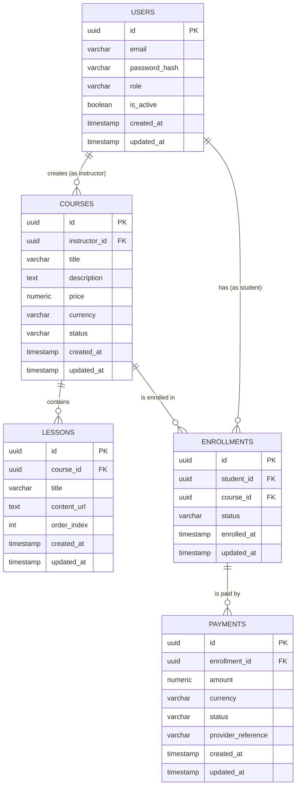

## ER Diagram

```mermaid
erDiagram
  USERS {
    uuid id PK
    varchar email
    varchar password_hash
    varchar role
    boolean is_active
    timestamp created_at
    timestamp updated_at
  }

  COURSES {
    uuid id PK
    uuid instructor_id FK
    varchar title
    text description
    numeric price
    varchar currency
    varchar status
    timestamp created_at
    timestamp updated_at
  }

  LESSONS {
    uuid id PK
    uuid course_id FK
    varchar title
    text content_url
    int order_index
    timestamp created_at
    timestamp updated_at
  }

  ENROLLMENTS {
    uuid id PK
    uuid student_id FK
    uuid course_id FK
    varchar status
    timestamp enrolled_at
    timestamp updated_at
  }

  PAYMENTS {
    uuid id PK
    uuid enrollment_id FK
    numeric amount
    varchar currency
    varchar status
    varchar provider_reference
    timestamp created_at
    timestamp updated_at
  }

  USERS ||--o{ COURSES : "creates (as instructor)"
  USERS ||--o{ ENROLLMENTS : "has (as student)"
  COURSES ||--o{ LESSONS : "contains"
  COURSES ||--o{ ENROLLMENTS : "is enrolled in"
  ENROLLMENTS ||--o{ PAYMENTS : "is paid by"
```
