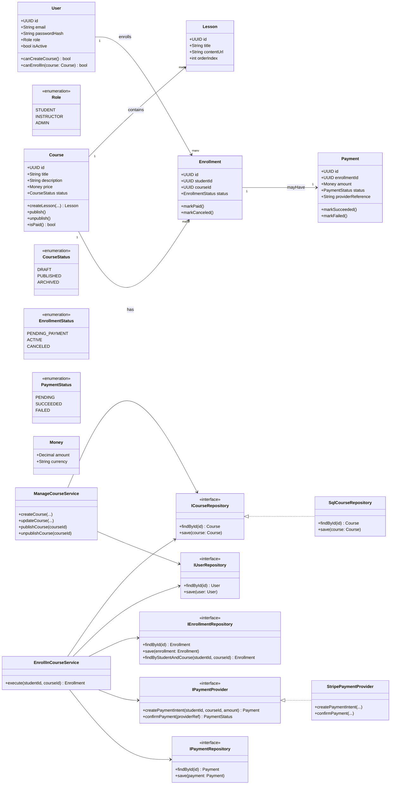

## Class Diagram (Simplified Clean Architecture View)

```mermaid
classDiagram
  direction LR

  class User {
    +UUID id
    +String email
    +String passwordHash
    +Role role
    +bool isActive
    +canCreateCourse() bool
    +canEnrollIn(course: Course) bool
  }

  class Role {
    <<enumeration>>
    STUDENT
    INSTRUCTOR
    ADMIN
  }

  class Course {
    +UUID id
    +String title
    +String description
    +Money price
    +CourseStatus status
    +createLesson(...) Lesson
    +publish()
    +unpublish()
    +isPaid() bool
  }

  class CourseStatus {
    <<enumeration>>
    DRAFT
    PUBLISHED
    ARCHIVED
  }

  class Lesson {
    +UUID id
    +String title
    +String contentUrl
    +int orderIndex
  }

  class Enrollment {
    +UUID id
    +UUID studentId
    +UUID courseId
    +EnrollmentStatus status
    +markPaid()
    +markCanceled()
  }

  class EnrollmentStatus {
    <<enumeration>>
    PENDING_PAYMENT
    ACTIVE
    CANCELED
  }

  class Payment {
    +UUID id
    +UUID enrollmentId
    +Money amount
    +PaymentStatus status
    +String providerReference
    +markSucceeded()
    +markFailed()
  }

  class PaymentStatus {
    <<enumeration>>
    PENDING
    SUCCEEDED
    FAILED
  }

  class Money {
    +Decimal amount
    +String currency
  }

  %% Application Layer
  class EnrollInCourseService {
    +execute(studentId, courseId) Enrollment
  }

  class ManageCourseService {
    +createCourse(...)
    +updateCourse(...)
    +publishCourse(courseId)
    +unpublishCourse(courseId)
  }

  class IPaymentProvider {
    <<interface>>
    +createPaymentIntent(studentId, courseId, amount) Payment
    +confirmPayment(providerRef) PaymentStatus
  }

  class ICourseRepository {
    <<interface>>
    +findById(id) Course
    +save(course: Course)
  }

  class IUserRepository {
    <<interface>>
    +findById(id) User
    +save(user: User)
  }

  class IEnrollmentRepository {
    <<interface>>
    +findById(id) Enrollment
    +save(enrollment: Enrollment)
    +findByStudentAndCourse(studentId, courseId) Enrollment
  }

  class IPaymentRepository {
    <<interface>>
    +findById(id) Payment
    +save(payment: Payment)
  }

  %% Infrastructure Layer Examples
  class StripePaymentProvider {
    +createPaymentIntent(...)
    +confirmPayment(...)
  }

  class SqlCourseRepository {
    +findById(id) Course
    +save(course: Course)
  }

  %% Relationships
  User "1" --> "many" Enrollment : enrolls
  Course "1" --> "many" Lesson : contains
  Course "1" --> "many" Enrollment : has
  Enrollment "1" --> "1" Payment : mayHave

  EnrollInCourseService --> ICourseRepository
  EnrollInCourseService --> IUserRepository
  EnrollInCourseService --> IEnrollmentRepository
  EnrollInCourseService --> IPaymentProvider
  EnrollInCourseService --> IPaymentRepository

  ManageCourseService --> ICourseRepository
  ManageCourseService --> IUserRepository

  IPaymentProvider <|.. StripePaymentProvider
  ICourseRepository <|.. SqlCourseRepository
```
